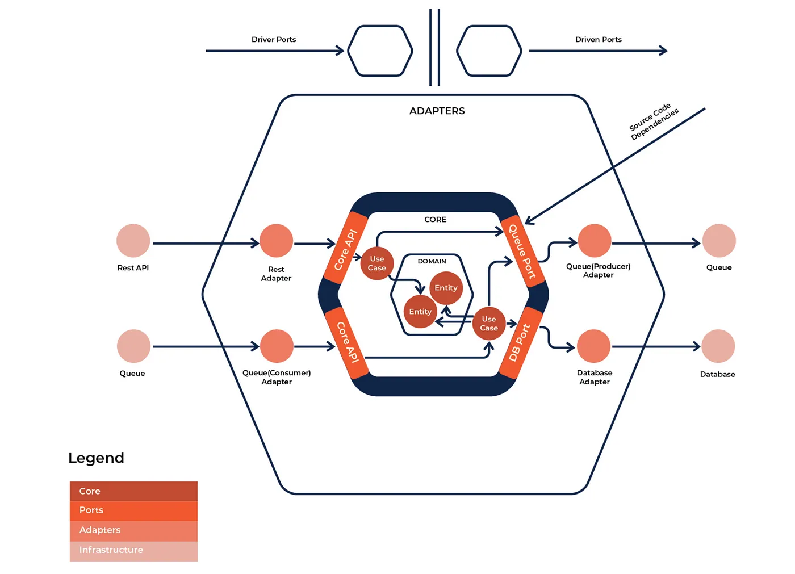

### Hexago(lang)nal Architecture

<pre>
Ticus
│
├── cmd
│   └── main.go
├── config
│   └── config.json
├── docs
│   ├── image
│   │   └── arch.webp
│   └── README.md
├── go.mod
├── go.sum
├── internal
│   ├── app
│   │   ├── adapter
│   │   │   ├── inbound
│   │   │   │   ├── api
│   │   │   │   │   ├── handler
│   │   │   │   │   │   ├── article.go
│   │   │   │   │   │   ├── auth.go
│   │   │   │   │   │   ├── common.go
│   │   │   │   │   │   ├── oauth.go
│   │   │   │   │   │   └── verify.go
│   │   │   │   │   ├── mapper
│   │   │   │   │   │   ├── article.go
│   │   │   │   │   │   ├── converter
│   │   │   │   │   │   │   └── article.go
│   │   │   │   │   │   ├── mapper.go
│   │   │   │   │   │   └── user.go
│   │   │   │   │   ├── middleware.go
│   │   │   │   │   ├── module.go
│   │   │   │   │   └── routes.go
│   │   │   │   ├── grpc
│   │   │   │   └── module.go
│   │   │   ├── module.go
│   │   │   └── outbound
│   │   │       ├── jwt
│   │   │       │   ├── jwt.go
│   │   │       │   └── module.go
│   │   │       ├── mailer
│   │   │       │   ├── mailer.go
│   │   │       │   └── module.go
│   │   │       ├── module.go
│   │   │       ├── oauth
│   │   │       │   ├── google.go
│   │   │       │   └── module.go
│   │   │       └── repository
│   │   │           ├── module.go
│   │   │           └── mysql
│   │   │               ├── connection.go
│   │   │               └── module.go
│   │   └── app_module.go
│   ├── core
│   │   ├── models
│   │   │   ├── article.go
│   │   │   ├── category.go
│   │   │   ├── model.go
│   │   │   ├── tag.go
│   │   │   └── user.go
│   │   ├── module.go
│   │   ├── ports
│   │   │   ├── article.go
│   │   │   ├── auth.go
│   │   │   └── port.go
│   │   └── services
│   │       ├── article.go
│   │       ├── auth.go
│   │       └── service.go
│   ├── infrastructure
│   │   ├── config
│   │   │   └── config.go
│   │   └── server
│   │       └── echo_server.go
│   └── pkg
│       └── utils
│           ├── article.go
│           └── jwt.go
├── Makefile
├── README.md
├── tmp
│   ├── build-errors.log
│   └── main
</pre>
